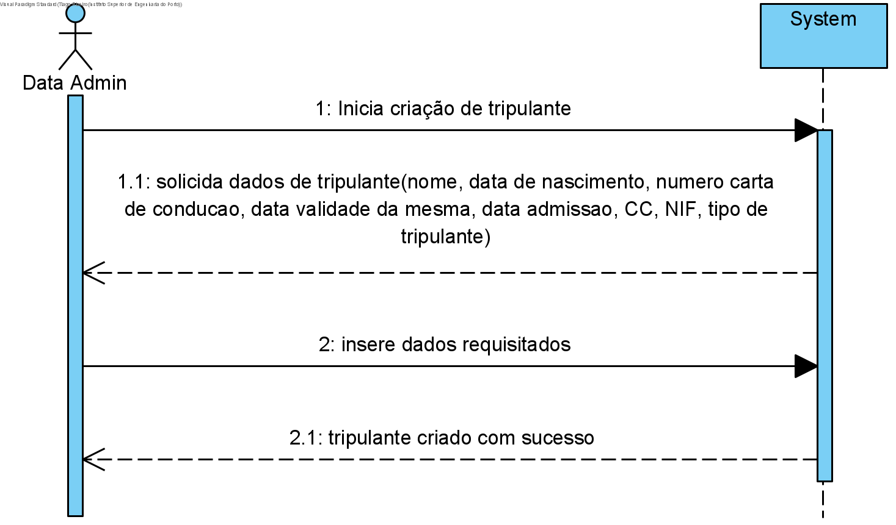

## **UC: 12**

### Como data administrator, quero definir tripulante (nome, data de nascimento, número de carta de condução, data de validade de licença de condução) associando um ou mais tipos de tripulante.

