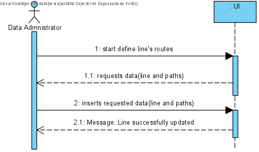
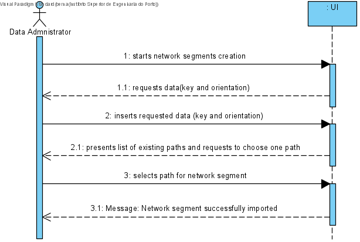

## **UC: 4**

### Como data administrator, quero definir um percurso de ida/volta de uma linha. Definir os vários segmentos que constituem um percurso indicando a ordem e a distância e tempo de viagem de cada segmento.

Segments/Pathnodes are the segments between two nodes:

