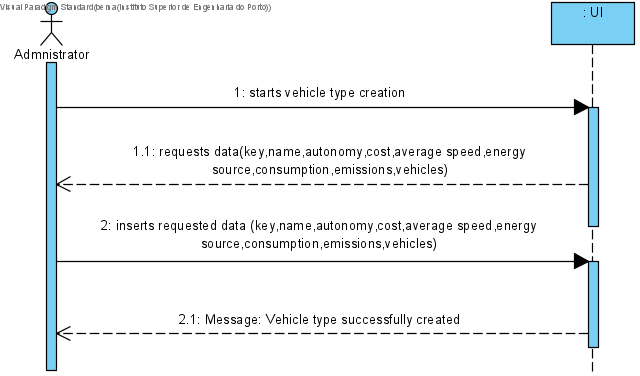

## **UC: 6**

### Como data administrator, quero criar tipo de viatura (ex., “minibus a gasóleo”), indicando o seu tipo de combustível (i.e., Diesel, Gasolina, Elétrico, GPL, Gás), autonomia, custo por quilómetro, consumo médio e velocidade média.

