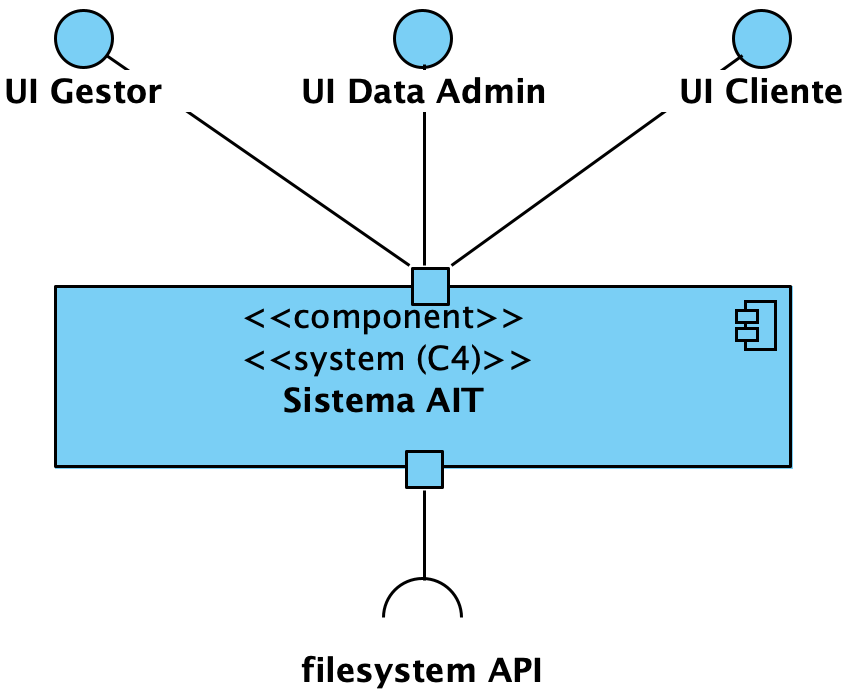

## Vista Lógica - Nível 1

------------------------------
A vista lógica (diagrama de componentes) pretende dar uma visão geral da estrutura e organização da arquitetura do sistema. Este é o nível 1, que é uma visão completamente abstrata. Nos níveis acima, vamos poder ver um maior nível de granularidade.

--------------------------------
