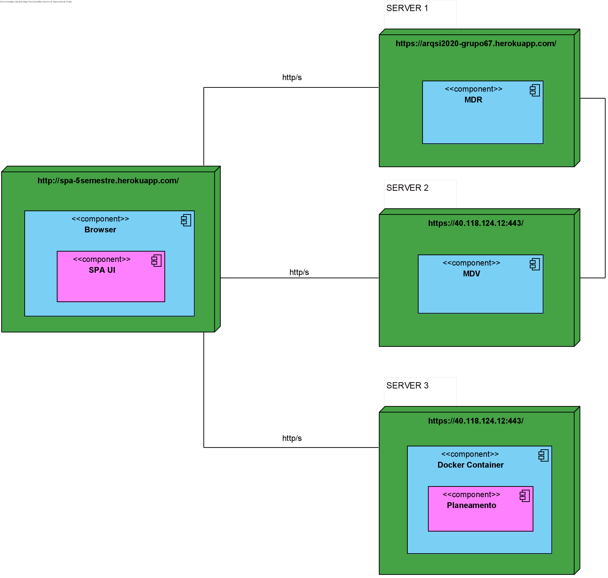

## Vista Física - Nível 2

------------------------------
Esta vista, é em relação mapeamento dos vários componentes do software em hardware, isto é, onde é executado o software.

--------------------------------
