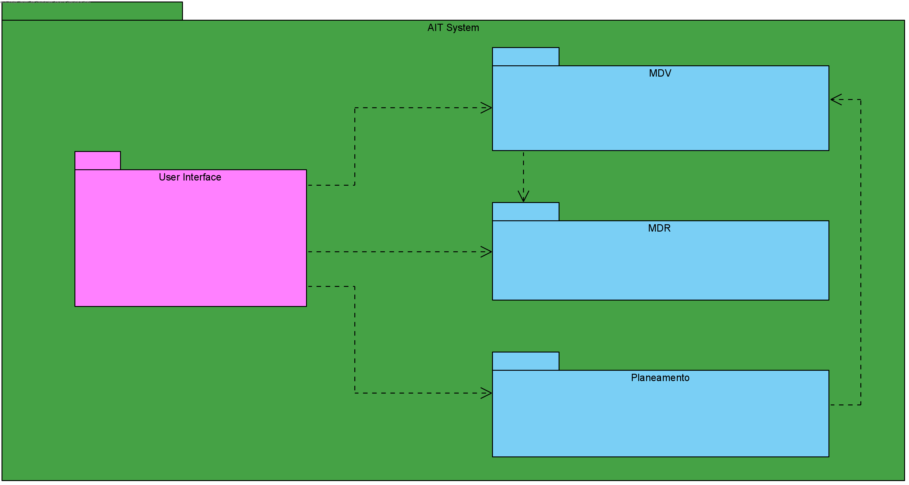

## Vista de Implementação - Nível 2

------------------------------
Esta vista, é a transição da visão lógica do sistema, para a visão de implementação, que pretende demonstrar os pacotes, interfaces, e classes do sistema, dando assim uma vista mais evidente de como o sistema está implementado.

--------------------------------
