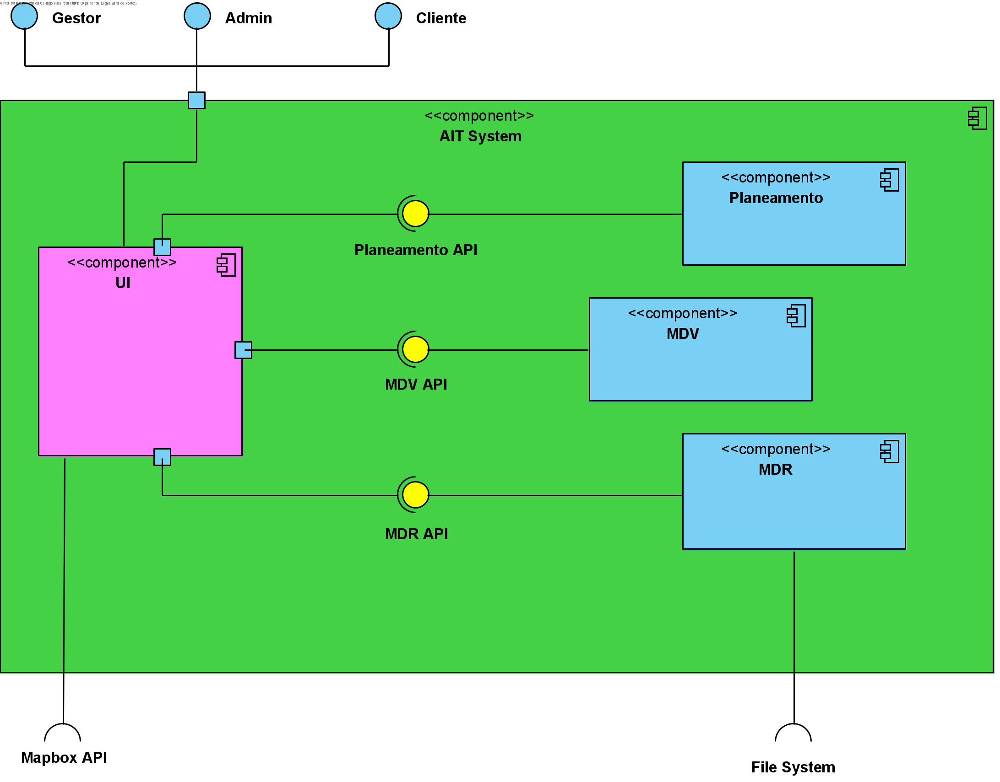

## Vista Lógica - Nível 2

------------------------------
A vista lógica (diagrama de componentes) pretende dar uma visão geral da estrutura e organização da arquitetura do sistema. Este é o nível 2, que é uma visão menos abstrata da que vimos no nível 1. No nível acima, no nível 3, vamos ver em detalhe os componentes de todos os módulos do sistema.

--------------------------------
