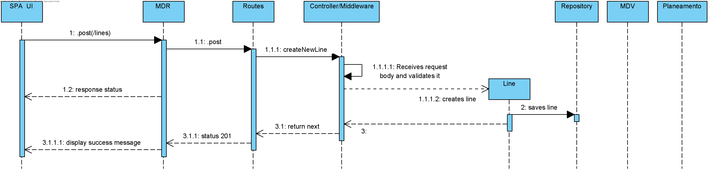

## **UC: 3**
## Nível 3
-----------------------
### Como data administrator, quero criar linha indicando o seu código (ex., “C”), nome (ex., “Linha Verde”) e os seus nós terminais (ex., Campanhã, ISMAI), bem como eventuais restrições sobre o tipo de viatura e tipo de tripulante.
-----------------------

