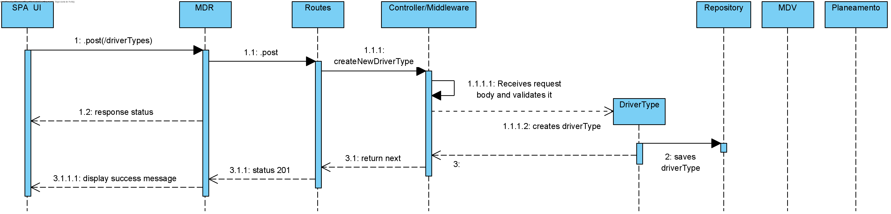

## **UC: 5**
## Nível 3
-----------------------
### Como data administrator, quero criar tipo de tripulante, ex., “motorista sénior com conhecimento de línguas estrangeiras”. Um tipo de tripulante é uma descrição livre (não catalogada) de características.

-----------------------

