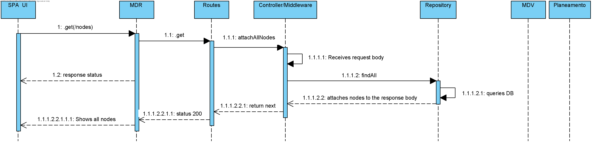

## **UC: 7**
## Nível 3
-----------------------
### Como data administrator, quero listar nós de rede. O utilizador deve poder ordenar por código/nome e filtrar por código/nome (ex., todos os nós cujo nome começa por “Par”) os resultados.

-----------------------

