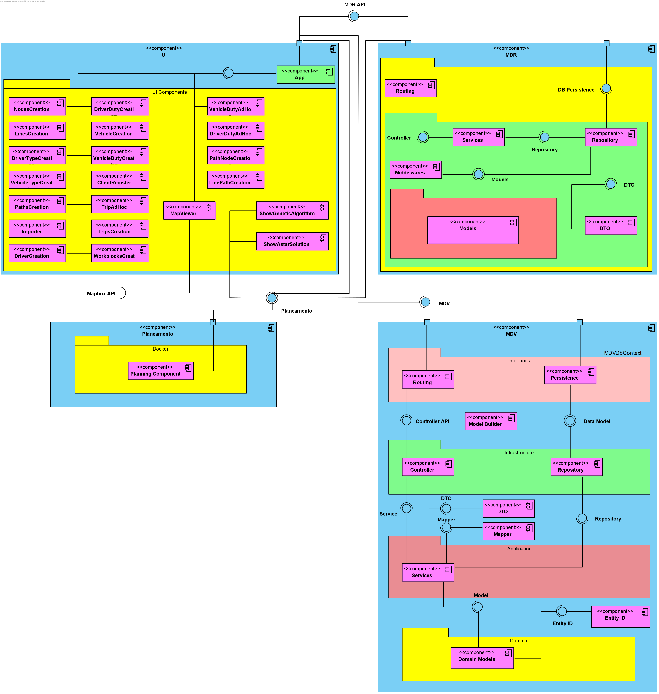

## Vista Lógica - Nível 3

------------------------------
A vista lógica (diagrama de componentes) pretende dar uma visão geral da estrutura e organização da arquitetura do sistema. Este é o nível 3, que é a visão menos abstrata dos três níveis representado neste DAS. 

--------------------------------

